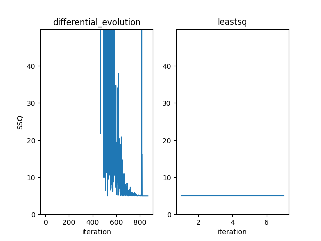
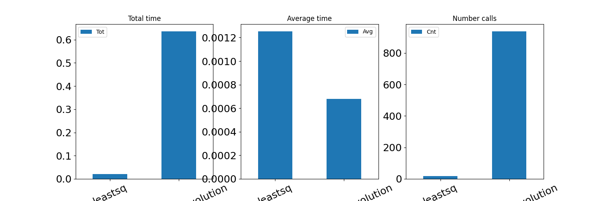

Adanced Fitting
=====================================

This section describes how to use advanced features of ``fitterpp``.
The section assumes that you have read the
basic tutorial. Specifically, you should be
familiar with the following the ``calcParabola`` function
we used as an example of fitting

.. code-block:: python

    def calcParabola(center=None, mult=None, xvalues=XVALUES):
        estimates = np.array([mult*(n - center)**2 + for n in xvalues])
        return pd.DataFrame({"x": xvalues, "y": estimates})

and the following script that fits the observational data ``data_df``
to the parameters ``center`` and ``mult`` in ``calcParabola``.

.. code-block:: python

    # Import the required libraries
    import lmfit
    import fitterpp as fpp
    # Construct the parameter objects
    parameters = lmfit.Parameters()
    parameters.add("center", value=0, min=0, max=100)
    parameters.add("mult", value=0, min=0, max=100)
    # Run the fitting algorithm
    fitter = fpp.Fitterpp(calcParabola, parameters, data_df)
    fitter.execute()
    # Display the fittted values
    print(fitter.final_params.valuesdict())

A first consideration in more advanced fitting is to have more
control over the way in which ``fitterpp`` searches for parameter
values.
This is accompished by making use of an optional keyword parameter
in the constructor, ``fpp.Fitterpp``.
You can specify any algorithm that is used by ``lmfit.minmize``.
To simplify common usage, ``fitterpp`` provides global constants
for the "leastsq" and "differential_evolution" algorithms.

.. code-block:: python

    # Spsecify the methods used for fitting
    methods = fpp.Fitterpp.mkFitterMethod(
          method_names=fpp.METHOD_DIFFERENTIAL_EVOLUTION,
          method_kwargs={fpp.MAX_NFEV: 1000})
    fitter = fpp.Fitterpp(calcParabola, parameters, data_df,
          methods=methods)

A second consideration in more advanced fitting is the tradeoff between
the followin:
* quality of the fit and
* runtime of the fitting codes.

Runtime of the fitting codes is typically measured in seconds.
We quantify the quality of the fit by the sum of squares of the
residuals or **RSSQ**.
If there is a perfect match between the observational data and the
estimates produced by fitted parameters, then 
RSSQ is 0.
Larger values of RSSQ indicate a fit that with lower quality.
Many times a fitting problem involves trade-offs between quality and runtime.

You can get a basic understanding of the quality of the fit
from the fitter report.
Building on the example in the basic tutorial,
As before, we are fitting the parameters of ``calcParabola``.
To use this feature, first perform a fit and then use

.. code-block:: python

    print(fitter.report())

This produces the output below:

.. code-block:: python

    [[Variables]]
        mult:  2.0102880244080366
        center:  10.000857728276536
    [[Fit Statistics]]
        # fitting method   = differential_evolution
        # function evals   = 921
        # data points      = 20
        # variables        = 2
        chi-square         = 2.54104032
        reduced chi-square = 0.14116891
        Akaike info crit   = -37.2631740
        Bayesian info crit = -35.2717095

Of most interest here is the number of function evalutions--921.
This provides some insight into the extent of the search
for fitting values.

The quality plot indicates how RSSQ changes across
iterations.
Sometimes, a large fraction of iterations do not result
in reductions in RSSQ.
To generate the quality plot use:

.. code-block:: python

    fitter.plotQuality()

which produces the plot

Note that the y-axis of the plot is scaled to show RSSQ values within
ten times the minimal RSSQ.
From this plot, we observe that (a) differential evolution rquires about
800 iterations before RSSQ is reduced substantially; and (b) gradient descent
("leastsq") provides little reduction in RSSQ.

Finally, the performance plot provides insight into
the causes of long runtimes.
To generate the performance plot use:

.. code-block:: python

    fitter.plotPerformance()

which produces the plot below.

From this we conclude that the time required to fit the parameters
is large due to the large number of iterations of
differential evolution.
