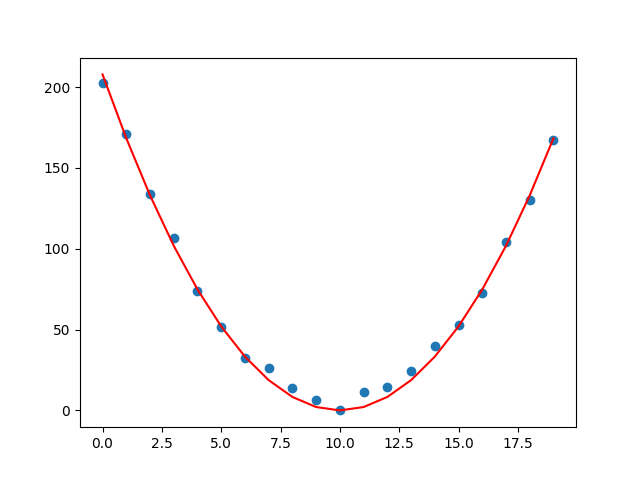

Fitting Basics
===========================

This section describes the basic usage of ``fitterpp``.

To install the package use:
    ``pip install fitterpp``

To use the package in your code, include the following statement
at the top of your python module:

    ``import fitterpp as fpp``

To do fitting, you must first write a parameterized function.
For example, consider the following function for a parabola
the has two parameters:
* where the parabola is centered on the x-axis
* a multiplier for how quickly the y-value increases

.. code-block:: python

    def calcParabola(center=None, mult=None, xvalues=range(20), is_dataframe=True):
        estimates = np.array([mult*(n - center)**2 for n in xvalues])
        if is_dataframe:
            result = pd.DataFrame({"row_key": xvalues, "y": estimates})
            result = result.set_index("row_key")
        else:
            result = np.array([estimates])
            result = np.reshape(result, (len(estimates), 1))
        return result

Note that all arguments to ``calcParabola`` are specified using keywords.
``Fitterpp`` requires both an array and ``DataFrame`` output for efficiency reasons and to make
the user function self-describing.
The keyword argument ``is_dataframe`` specifies whether to return a ``numpy`` array or a ``DataFrame``.
The array should contain only the data values.
The ``DataFrame`` must:

* contain columns names that match some of the names in data provided to ``Fitterpp``;
* have an index with values that have a non-null intersection with index values in the data provided to ``Fitterpp``.

You will also need to describe the parameters to be fitted.
In our example, these are ``center`` and ``mult``.
You use
`lmfit.Parameters <(https://lmfit.github.io/lmfit-py/parameters.html>`_
to describe these parameters, as shown below.

.. code-block:: python

    parameters = lmfit.Parameters()
    parameters.add("center", value=0, min=0, max=100)
    parameters.add("mult", value=0, min=0, max=100)

Last, you must provide data that is used to fit the parameters.
The data should be a ``pandas`` ``DataFrame`` that has some (or all)
of the columns present in the output of the function to be fit.

.. code-block:: python

    print(data_df)
    row_key   y
    0       203.602263
    1       168.826647
    2       129.106718
    3       106.392522
    4        76.568092
    5        53.599780
    6        32.178451
    7        27.475269
    8        17.673933
    9         5.571118
    10        9.088864
    11        4.040736
    12       10.043712
    13       20.858908
    14       32.427186
    15       53.417786
    16       80.242909
    17      104.973683
    18      132.189584
    19      169.439043

and outputs
a list (or list-like) of floats that are the difference between
what the function computed for these parameter values and observational
data.

To do a fit, use:

.. code-block:: python

    fitter = fpp.Fitterpp(calcParabola, parameters, data_df , methods=methods)
    fitter.execute()

To see the resulting fits:a

.. code-block:: python

    >print(fitter.final_params.valuesdict())
    {'center': 9.991226336877833, 'mult': 2.072849009501976}

The figure below displays the parabola (red line plot)
for the above fitted parameter values
along with the fitting data (blue scatter plot).

